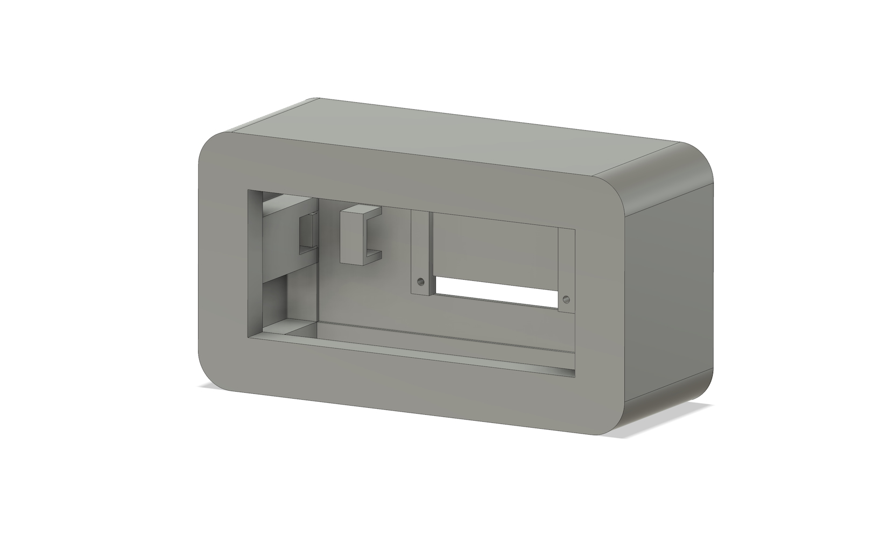

# DisplayGadget

**DisplayGadget** is a modular, extensible dashboard for ESP8266-based microcontrollers with a 20x4 I2C LCD display. It provides real-time data such as weather, time, Wi-Fi status, news headlines, and indoor climate. Users can navigate views and trigger actions using an infrared (IR) remote.


## ✨ Features

- **Weather Display:** Current conditions from OpenWeatherMap  
- **Time Sync:** Accurate time via NIST time servers  
- **News Headlines:** Displays RSS news feeds  
- **Indoor Climate:** Temperature and humidity from a DHT11 sensor  
- **Wi-Fi Status:** SSID, IP, and signal strength info  
- **IR Remote Control:** Navigate menus and trigger functions  
- **Modular Architecture:** Add new views and data sources easily  
- **Pixel Art & Custom Characters:** Fun, animated display options  

## 🛠️ Hardware Setup

| Component               | ESP8266 Pin |
|------------------------|-------------|
| LCD SDA                | D2          |
| LCD SCL                | D1          |
| IR Receiver Data       | D5          |
| DHT11 Sensor Data      | D6          |


Supported boards include NodeMCU, Wemos D1 mini, and other ESP8266 variants.

##Enclosure
The custom case was designed for 3D printing—STL files are available in the enclosure/ folder for download and printing.
]


## 🧰 External Libraries

- **LCD I2C:** [`duinowitchery/hd44780@^1.3.2`](https://github.com/duinoWitchery/hd44780)
- **IR Receiver:** [`crankyoldgit/IRremoteESP8266@^2.8.6`](https://github.com/crankyoldgit/IRremoteESP8266)
- **DHT Sensor:**
  - [`adafruit/Adafruit Unified Sensor @ ^1.1.15`](https://github.com/adafruit/Adafruit_Sensor)
  - [`adafruit/DHT sensor library @ ^1.4.6`](https://github.com/adafruit/DHT-sensor-library)
- **Data Parsing:** [`bblanchon/ArduinoJson @ ^7.4.2`](https://github.com/bblanchon/ArduinoJson)

## 🧱 Project Structure

```plaintext
DisplayGadget/
├── src/                        # Source code
│   ├── main.cpp                # Arduino entry point
│   ├── system/                 # Core system logic
│   │   ├── controller.*        # App lifecycle & control logic
│   │   ├── view_controller.*   # Manages switching between views
│   │   ├── display.*           # LCD rendering utilities
│   │   └── ir_receiver.*       # IR remote decoding
│   ├── views/                  # UI views (screen modes)
│   │   ├── view.*              # Base abstract class for all views
│   │   ├── default_view.*      # Shows time, weather, and DHT sensor data
│   │   ├── news_view.*         # Displays RSS news feed
│   │   └── menu_view.*         # Menu interface (e.g. settings, actions)
│   ├── network/                # Networking and APIs
│   │   ├── network.*           # Wi-Fi connection and utility functions
│   │   ├── weather.*           # OpenWeatherMap API integration
│   │   ├── time_utils.*        # Time synchronization with NIST
│   │   └── rss_reader.*        # RSS news headline parser
│   └── sensors/                # Sensor integrations
│       └── dht_sensor.*        # DHT11 temperature/humidity interface
├── include/                    # Header files (optional if used)
├── lib/                        # External libraries (if manually included)
├── data/                       # SPIFFS or LittleFS data (optional)
├── secrets.h                   # Wi-Fi & API keys (excluded from version control)
├── platformio.ini              # PlatformIO build configuration
└── README.md                   # Project documentation
```

## 🚀 Getting Started

1. **Clone this repository**
2. **Install [PlatformIO](https://platformio.org/)** (recommended via VS Code)
3. **Configure your `secrets.h`:**

    ```cpp
    #define WIFI_SSID "your-ssid"
    #define WIFI_PASS "your-password"
    #define OPENWEATHERMAP_API_KEY "your-api-key"
    #define NEWS_URL "your-rss-url"
    #define TIMEZONE_OFFSET -5 // e.g., CST
    #define DAYLIGHT_SAVING_TIME 1
    ```

4. **Wire your hardware** according to the diagram above
5. **Build and upload** to your ESP8266 board

## 🧪 Planned Features & TODOs

- [ ] Local server to push messages remotely  
- [ ] Pixel art & fun LCD animations  
- [ ] Custom character support  
- [ ] Wi-Fi AP setup  
- [ ] EEPROM settings storage  
- [ ] View pagination and transitions  
- [ ] Wi-Fi signal strength indicator  
- [ ] `secrets.h` auto-generator for easier setup  
